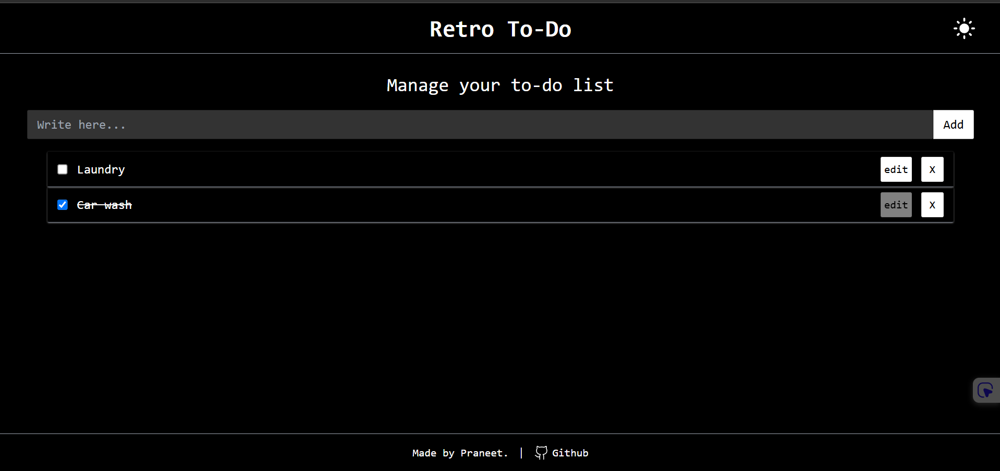

✅ Retro Todo App
A minimalist Retro-style Todo App built with React.js and custom CSS. Clean UI, old-school vibes, and all the core features you'd expect from a todo list—just with more nostalgia.

🧠 Features

- Add, delete, and check off tasks

- Classic retro UI styling

- Responsive and mobile-friendly

- State persists using local storage

🛠️ Tech Stack

React.js – Functional components + hooks

CSS – Custom retro-style design

LocalStorage – For saving tasks

✅ Retro Todo App

A minimalist Retro-style Todo App built with React.js and custom CSS. Clean UI, old-school vibes, and all the core features you'd expect from a todo list—just with more nostalgia.

🧠 Features

- Add, delete, and check off tasks

- Classic retro UI styling

- Responsive and mobile-friendly

- State persists using local storage

🛠️ Tech Stack

- React.js – Functional components + hooks

- CSS – Custom retro-style design

- LocalStorage – For saving tasks

🚀 Live Demo

[retro-todo.vercel.app](https://retro-todo.vercel.app/)

📸 Screenshots

